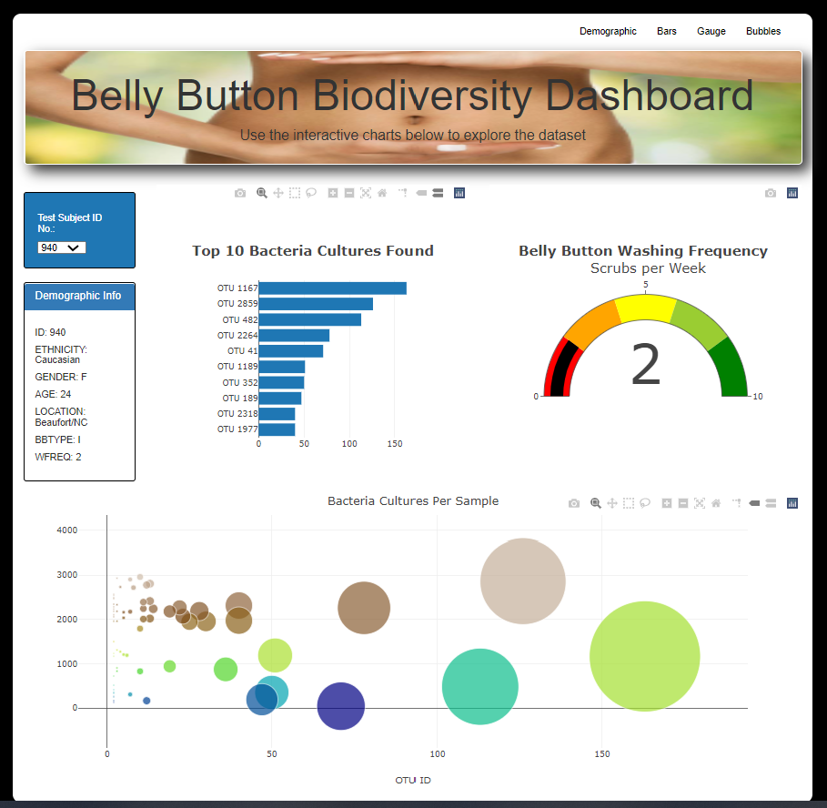

#Plotly Dashboard

Used the D3 library to read data from a json file, and used HTML, Bootstrap, Javascript and Plotly CDN to create an interactive dashboard to explore the [Belly Button Biodiversity dataset](http://robdunnlab.com/projects/belly-button-biodiversity/) which catalogs the microbes that colonize human navels. The dashboard updates all of the plots any time that a new sample is selected.  Displays the individual's demographic information and each key-value pair from the metadata JSON object on the page and adapts a gauge chart to plot the weekly washing frequency of the individual.

The dataset reveals that a small handful of microbial species (also called operational taxonomic units, or OTUs, in the study) were present in more than 70% of people, while the rest were relatively rare.

